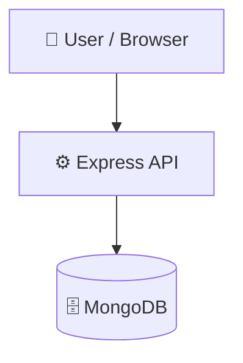

# EcoQuest

   

## 📑 Table of Contents

- [Description](#description)
- [Screenshots](#screenshots)
- [Tech Stack](#tech-stack)
- [Architecture](#architecture)
- [Quick Start](#quick-start)
- [Key Dependencies](#key-dependencies)
- [Project Structure](#project-structure)
- [Development Setup](#development-setup)
- [Contributors](#contributors)
- [Contributing](#contributing)

## 📝 Description

EcoQuest — a backend api built with Express.js, JavaScript, MongoDB, Vite.

## 🛠️ Tech Stack

   

**Notable libraries:** Mongoose, Multer

## 🏗️ Architecture

A high-level view of how the main pieces fit together:



## ⚡ Quick Start

```bash

# 1. Clone the repository
git clone https://github.com/sundram1343/EcoQuest.git

# 2. Install dependencies
npm install

# 3. Start the dev server
npm run dev
```

## 📦 Key Dependencies

```
bcrypt: ^6.0.0
cors: ^2.8.6
dotenv: ^17.4.2
express: ^5.2.1
init: ^0.1.2
jsonwebtoken: ^9.0.3
mongoose: ^9.6.1
multer: ^2.1.1
nodemon: ^3.1.14
```

## 📁 Project Structure

```
.
├── Backend
│   ├── app.js
│   ├── config
│   │   └── db.js
│   ├── controllers
│   │   ├── Questcontroller.js
│   │   ├── authController.js
│   │   └── userController.js
│   ├── middleware
│   │   ├── authMiddleware.js
│   │   └── uploadMiddleware.js
│   ├── models
│   │   ├── quest-model.js
│   │   └── user-model.js
│   ├── package.json
│   └── routes
│       ├── authRoutes.js
│       ├── questRoutes.js
│       └── userRouter.js
├── Frontend
│   ├── eslint.config.js
│   ├── index.html
│   ├── package.json
│   ├── public
│   │   ├── favicon.svg
│   │   └── icons.svg
│   ├── src
│   │   ├── App.css
│   │   ├── App.jsx
│   │   ├── Components
│   │   │   ├── Footer
│   │   │   │   ├── Footer.css
│   │   │   │   └── Footer.jsx
│   │   │   ├── NavBar
│   │   │   │   ├── Navabr.jsx
│   │   │   │   └── Navbar.css
│   │   │   └── OnProfileClick
│   │   │       ├── OnProfileClick.css
│   │   │       └── OnProfileClick.jsx
│   │   ├── Pages
│   │   │   ├── Home
│   │   │   │   ├── Home.css
│   │   │   │   └── Home.jsx
│   │   │   ├── Impact
│   │   │   │   ├── Impact.css
│   │   │   │   └── Impact.jsx
│   │   │   ├── LeaderBoard
│   │   │   │   ├── LeaderBoard.css
│   │   │   │   └── LeaderBoard.jsx
│   │   │   ├── Login
│   │   │   │   ├── SignUp.css
│   │   │   │   ├── SignUp.jsx
│   │   │   │   ├── login.css
│   │   │   │   └── login.jsx
│   │   │   ├── Profile
│   │   │   │   ├── Profile.css
│   │   │   │   └── Profile.jsx
│   │   │   └── Tasks
│   │   │       ├── Tasks.css
│   │   │       └── Tasks.jsx
│   │   ├── assets
│   │   │   ├── HomeImage.png
│   │   │   ├── ImpactPage.png
│   │   │   └── SignUpImage.png
│   │   ├── context
│   │   │   └── AuthContext.jsx
│   │   ├── index.css
│   │   └── main.jsx
│   └── vite.config.js
└── README.MD
```

## 🛠️ Development Setup

### Node.js / JavaScript
1. Install Node.js (v18+ recommended)
2. Install dependencies: `npm install` (or `yarn` / `pnpm install` / `bun install`)
3. Start the dev server: see the **Quick Start** above

## 👥 Contributors

Thanks to everyone who has contributed to this project:

<p align="left">
<a href="https://github.com/sundram1343" title="sundram1343"></a>
<a href="https://github.com/Pratushshukla" title="Pratushshukla"></a>
</p>

[See the full list of contributors →](https://github.com/sundram1343/EcoQuest/graphs/contributors)

## 👥 Contributing

Contributions are welcome! Here's the standard flow:

1. **Fork** the repository
2. **Clone** your fork: `git clone https://github.com/sundram1343/EcoQuest.git`
3. **Branch**: `git checkout -b feature/your-feature`
4. **Commit**: `git commit -m 'feat: add some feature'`
5. **Push**: `git push origin feature/your-feature`
6. **Open** a pull request

Please follow the existing code style and include tests for new behavior where applicable.

---

<div align="center">

[](https://readmebuddy.com)

<sub>Generate beautiful READMEs in seconds → <a href="https://readmebuddy.com">readmebuddy.com</a></sub>

</div>
